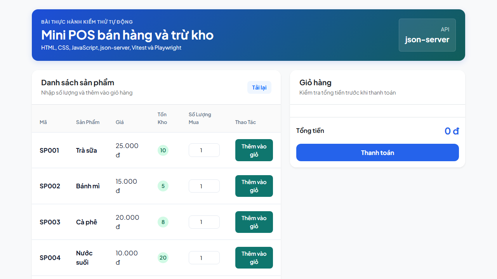

# Mini POS - Bán Hàng & Trừ Kho (Automation Testing & CI/CD Demo)

[](https://github.com/your-username/mini-pos/actions)
[](https://opensource.org/licenses/MIT)

Dự án **Mini POS bán hàng và trừ kho** là một ứng dụng Web Single-Page Application (SPA) thu nhỏ, được thiết kế chuyên biệt làm mẫu thực hành cho môn học **Kiểm thử tự động (Test Automation)** kết hợp quy trình tích hợp liên tục **CI/CD**. 

Dự án mô phỏng trọn vẹn quy trình nghiệp vụ bán hàng tại quầy (POS), kiểm tra điều kiện tồn kho thực tế thông qua Mock API, đồng thời áp dụng mô hình kiểm thử phân lớp khoa học: **Unit Test** độc lập cho logic nghiệp vụ giỏ hàng và **E2E Test** giả lập hành vi người dùng trên giao diện thực tế.

---

## 📸 Giao diện ứng dụng

Dưới đây là hình ảnh giao diện thực tế của ứng dụng Mini POS:



*(Lưu ý: Nếu bạn tải dự án về, vui lòng chụp lại màn hình giao diện của bạn, lưu với tên `ui_preview.png` và đặt vào thư mục `src/images/` để hiển thị chính xác ảnh preview của riêng bạn trên GitHub).*

---

## 🎯 Tính năng cốt lõi (Core Features)

- **Hiển thị danh sách sản phẩm động**: Tải danh sách sản phẩm (Mã, Tên, Giá, Tồn kho) thời gian thực từ Mock API Server.
- **Ràng buộc số lượng mua hàng (Validation)**:
  - Ngăn chặn nhập số lượng mua là số âm hoặc số thập phân.
  - Ngăn chặn mua số lượng bằng `0`.
  - Ngăn chặn mua vượt quá số lượng tồn kho hiện tại trên hệ thống.
  - Kiểm tra và ngăn chặn cộng dồn số lượng trong giỏ vượt quá tồn kho thực tế.
- **Quản lý giỏ hàng thời gian thực**:
  - Tự động cộng dồn số lượng và tính thành tiền của từng dòng mặt hàng.
  - Tính tổng giá trị đơn hàng tự động.
  - Hỗ trợ **Xóa sản phẩm** trực tiếp khỏi giỏ hàng kèm theo **Modal xác nhận hủy** chuyên nghiệp của Bootstrap 5.
- **Thanh toán & Trừ kho**:
  - Gửi yêu cầu cập nhật tồn kho (PATCH request) lên API Server cho từng mặt hàng được mua.
  - Tự động làm rỗng giỏ hàng và tải lại danh sách sản phẩm mới nhất sau khi thanh toán thành công.
  - Hiển thị hộp thoại thông báo bằng **SweetAlert2** có hiệu ứng hoạt họa và tự động đóng sau 3 giây.
  - Ngăn chặn hành động thanh toán khi giỏ hàng rỗng và hiển thị cảnh báo tương ứng.

---

## 🛠️ Công nghệ sử dụng (Tech Stack)

| Công nghệ | Vai trò trong dự án |
| :--- | :--- |
| **HTML5 / CSS3 / Vanilla JS** | Xây dựng cấu trúc, thiết kế giao diện và điều phối logic người dùng trực tiếp trên trình duyệt mà không phụ thuộc vào Framework (React/Vue/Angular). |
| **Bootstrap 5** | Cung cấp hệ thống lưới (Grid CSS), kiểu dáng giao diện phẳng hiện đại và các thành phần UI (Modal, Badges, Cards). |
| **SweetAlert2** | Thư viện hiển thị hộp thoại thông báo (Alert) chuyên nghiệp, sinh động, tương thích tốt với các công cụ Automation Test. |
| **json-server** | Tạo Mock API RESTful cục bộ chạy ở cổng `3000` để tương tác đọc/ghi cơ sở dữ liệu giả lập từ tệp `db.json`. |
| **Vitest** | Công cụ chạy Unit Test cực nhanh, giúp kiểm thử các hàm tính toán và ràng buộc giỏ hàng một cách cô lập. |
| **Playwright** | Framework kiểm thử giao diện đầu cuối (E2E Test) giả lập chính xác hành động bấm chuột, nhập liệu của khách hàng trên Chrome, Firefox và Webkit. |
| **concurrently** | Tiện ích hỗ trợ khởi động song song cả Vite dev server và json-server chỉ bằng một lệnh duy nhất. |

---

## 📂 Cấu trúc thư mục (Project Structure)

Dự án được tổ chức theo cấu trúc phân tách trách nhiệm rõ ràng (Separation of Concerns), giúp tối ưu hóa việc viết mã nguồn và xây dựng các bộ test độc lập:

```text
mini-pos-ggangravity/
├── .github/workflows/         # Cấu hình CI/CD chạy test tự động khi push/PR
├── src/                       # Mã nguồn ứng dụng Frontend
│   ├── css/
│   │   └── styles.css         # CSS tùy biến giao diện phẳng, hiệu ứng hover & gradients
│   ├── images/                # Thư mục lưu trữ hình ảnh preview dự án
│   │   └── ui_preview.png     # Hình ảnh giao diện thực tế hiển thị trong README
│   ├── services/              # Các dịch vụ xử lý logic và gọi API
│   │   ├── cartService.js     # Chứa logic nghiệp vụ giỏ hàng thuần túy (Không dùng DOM/API - Dành cho Unit Test)
│   │   └── productApi.js      # Thực hiện các lệnh gọi fetch (GET, PATCH) đến json-server
│   ├── utils/
│   │   └── formatMoney.js     # Hàm định dạng hiển thị tiền tệ (VND)
│   ├── main.js                # Tệp điều phối chính (Đọc DOM, xử lý sự kiện, cập nhật UI và Modal)
│   └── index.html             # Tệp giao diện chính của ứng dụng POS
├── tests/                     # Thư mục chứa các kịch bản kiểm thử tự động
│   ├── unit/
│   │   └── cartService.test.js # Bộ Unit Test cho logic giỏ hàng bằng Vitest
│   └── e2e/
│       └── pos.spec.js        # Bộ E2E Test cho giao diện người dùng bằng Playwright
├── db.json                    # Cơ sở dữ liệu tạm thời của json-server (bị thay đổi khi chạy thử/test)
├── db.seed.json               # Dữ liệu gốc dùng để khôi phục lại trạng thái ban đầu của database
├── package.json               # Khai báo thư viện phụ thuộc và lệnh script chạy dự án
├── playwright.config.js       # Cấu hình chạy test Playwright (workers, webServer tự khởi chạy...)
└── vitest.config.js           # Cấu hình Vitest (Chỉ định lọc thư mục test tránh quét nhầm file E2E)
```

---

## 🚀 Hướng dẫn cài đặt & Chạy dự án (Installation & Setup)

### Bước 1: Tải dự án về máy
```bash
git clone https://github.com/your-username/mini-pos.git
cd mini-pos
```

### Bước 2: Cài đặt các thư viện phụ thuộc
```bash
npm install
```

### Bước 3: Cài đặt môi trường trình duyệt cho Playwright (Chỉ chạy lần đầu)
```bash
npm run install:browsers
```

### Bước 4: Khôi phục cơ sở dữ liệu mẫu ban đầu
```bash
npm run reset-db
```

### Bước 5: Khởi chạy toàn bộ ứng dụng
```bash
npm start
```
*Lưu ý: Lệnh `npm start` sẽ tự khởi động đồng thời cả giao diện web ở địa chỉ `http://localhost:5173` và Mock API Server ở địa chỉ `http://localhost:3000`. Bạn không cần mở thêm terminal khác.*

---

## 🧪 Hướng dẫn chạy Test (Testing Guide)

### 1. Kiểm thử đơn vị (Unit Test) - Vitest
Bộ Unit Test chịu trách nhiệm kiểm tra tính chính xác của các hàm logic nghiệp vụ giỏ hàng (thêm, xóa, kiểm tra số lượng, tính tổng tiền) mà không cần bật trình duyệt hay API Server.

- **Chạy kiểm thử một lần xuất báo cáo:**
  ```bash
  npm run test:unit
  ```
- **Chạy ở chế độ theo dõi (Tự động chạy lại khi sửa code):**
  ```bash
  npm run test:unit:watch
  ```

### 2. Kiểm thử giao diện đầu cuối (E2E UI Test) - Playwright
Bộ E2E Test tự động khởi chạy trình duyệt ẩn, mô phỏng các thao tác click chuột, điền form, mua hàng, kiểm tra thông báo lỗi/thành công và kiểm tra việc cập nhật trừ kho trên database thực tế.

- **Chạy kiểm thử ở chế độ ẩn (Headless Mode):**
  ```bash
  npm run test:e2e
  ```
- **Chạy kiểm thử với giao diện tương tác (Playwright UI Mode):**
  ```bash
  npm run test:e2e:ui
  ```

---

## 🏷️ Định chuẩn `data-testid` (Automation Testing Conventions)

Để phục vụ tốt nhất cho việc viết bộ chọn (Selectors) trong kiểm thử tự động bằng Playwright mà không bị ảnh hưởng khi thay đổi class hoặc cấu trúc DOM, dự án áp dụng nghiêm ngặt các thuộc tính định danh `data-testid` sau:

| Thuộc tính `data-testid` | Phần tử HTML tương ứng | Ý nghĩa / Mục đích kiểm thử |
| :--- | :--- | :--- |
| `reload-button` | Nút `Tải lại` sản phẩm | Kích hoạt làm mới danh sách sản phẩm từ API |
| `product-list` | Thẻ `<tbody>` của bảng sản phẩm | Xác định khu vực chứa danh sách sản phẩm |
| `product-row-{id}` | Thẻ `<tr>` dòng sản phẩm | Kiểm tra dòng sản phẩm cụ thể có mã ID tương ứng |
| `product-stock-{id}` | Thẻ `<span>` hiển thị số tồn kho | Kiểm tra số lượng tồn kho hiển thị (đảm bảo giảm sau thanh toán) |
| `product-quantity-{id}` | Ô `<input type="number">` nhập số lượng | Điền số lượng sản phẩm muốn mua |
| `add-to-cart-{id}` | Nút `Thêm vào giỏ` từng sản phẩm | Kích hoạt thêm sản phẩm vào giỏ hàng |
| `cart-items` | Thẻ `<div>` chứa giỏ hàng | Kiểm tra giỏ hàng chứa đúng các sản phẩm đã chọn |
| `delete-item-{id}` | Nút `Xóa` trong thẻ sản phẩm ở giỏ | Kích hoạt mở modal hỏi xác nhận xóa sản phẩm đó |
| `cart-total` | Thẻ `<span>` hiển thị tổng tiền | Xác định và kiểm tra tổng tiền của toàn bộ giỏ hàng |
| `checkout-button` | Nút `Thanh toán` đơn hàng | Kích hoạt gửi yêu cầu thanh toán và trừ kho lên API |
| `message` | Hộp thoại thông báo (SweetAlert2 popup) | Đọc nội dung thông báo lỗi/thành công xuất hiện trên màn hình |

---
*Dự án được xây dựng bởi **Senior Fullstack Developer & Lead QA Automation Engineer** nhằm mục đích phục vụ giảng dạy và thực hành chất lượng cao.*
